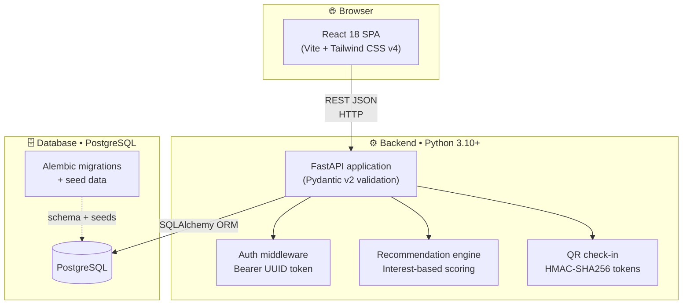
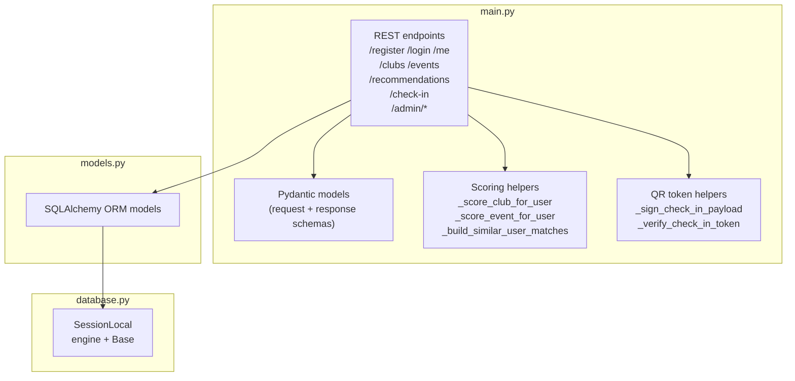
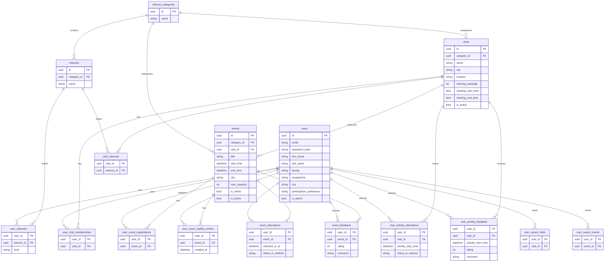
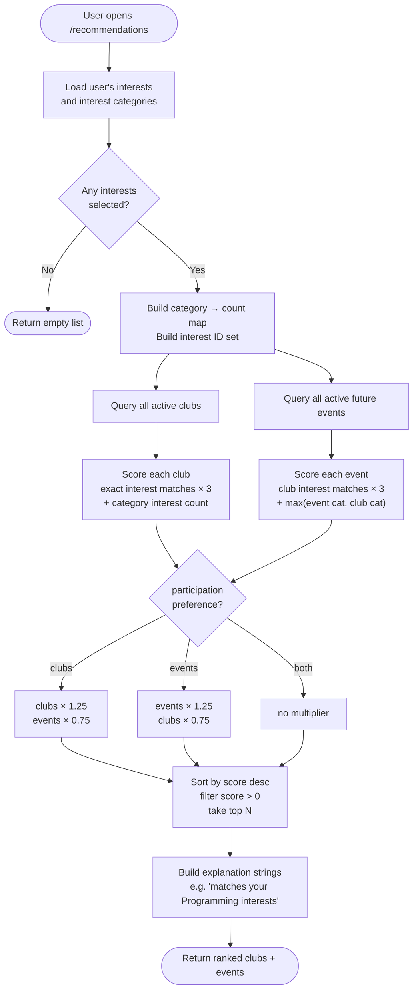
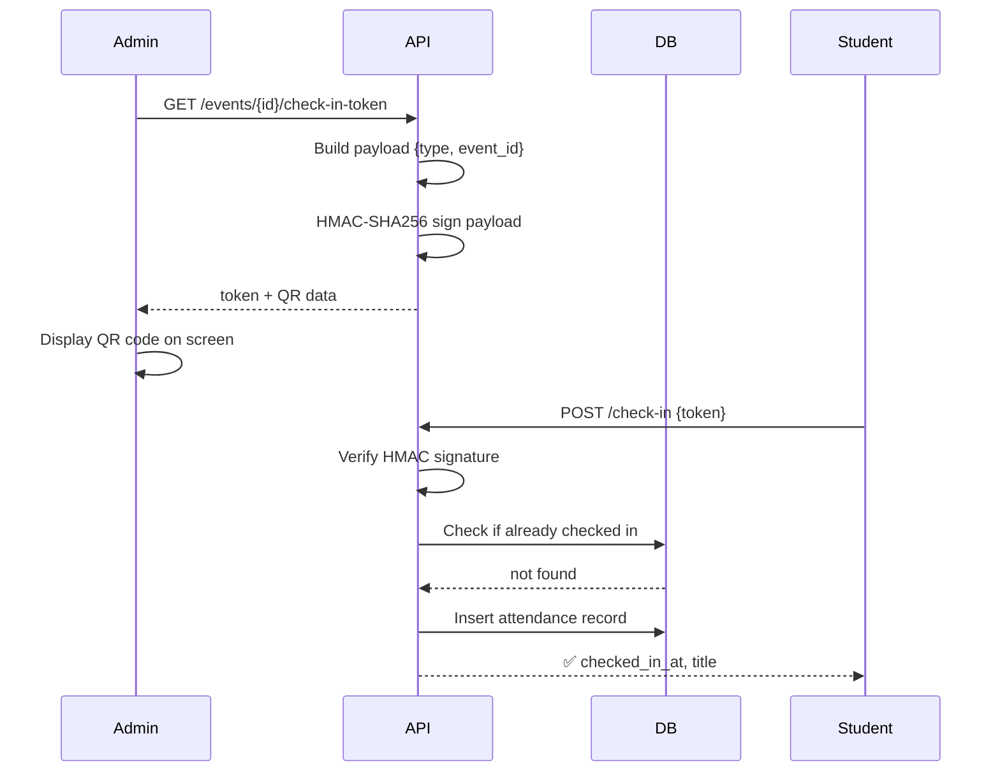
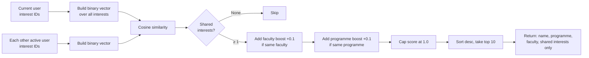

# 🏗️ Architecture

## System overview

JEAL follows a classic three-tier web architecture: a React SPA in the browser communicates with a FastAPI backend over HTTP/JSON, which reads and writes to a PostgreSQL database.

---

## Frontend structure

```mermaid
graph LR
    subgraph Pages
        Login & Register
        Onboarding["Onboarding quiz"]
        Main["Main feed\n(recommendations)"]
        Clubs["Clubs directory"]
        Events["Events browser"]
        ClubDetail["Club detail"]
        EventDetail["Event detail"]
        Dashboard
        CheckIn["QR Check-in"]
        Admin["Admin panel"]
    end

    subgraph Components
        UI["ui/ — Button, Card,\nInput, Alert, Select"]
        Auth2["AuthContext\n(login state)"]
        Lib["lib/ — clubMemberships\nsavedItems\nemptyStateMessages"]
        API["api/client.js\n(apiFetch wrapper)"]
    end

    Pages --> Components
```

**Routing** is handled by React Router v6. All authenticated pages read the logged-in `user_id` from `AuthContext` and attach it as an `Authorization: Bearer <uuid>` header via the shared `apiFetch` helper.

---

## Backend structure

---

## Database schema

---

## Recommendation algorithm

---

## QR check-in flow

---

## Similar users algorithm

*Only privacy-safe fields are exposed — no email, no user ID, no location.*
