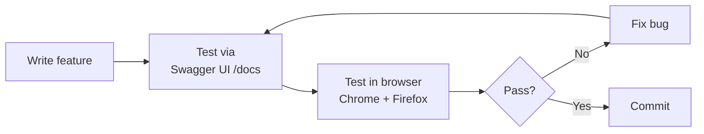

# 🧪 Testing

## Test approach

Testing was done manually via the FastAPI Swagger UI (`/docs`) and direct browser interaction. No automated test suite was written (time constraint of the university project).

---

## Backend API tests

Tested at **http://127.0.0.1:8000/docs**

### Auth & registration

| # | Test | Expected | Result |
|---|------|----------|--------|
| 1 | Register with password shorter than 8 chars | `422` validation error | ✅ Pass |
| 2 | Register with no uppercase letter in password | `422` validation error | ✅ Pass |
| 3 | Register with no special character | `422` validation error | ✅ Pass |
| 4 | Register with valid credentials | `200`, `user_id` returned | ✅ Pass |
| 5 | Register again with same email | `400` "already exists" | ✅ Pass |
| 6 | Login with wrong password | `401 Unauthorized` | ✅ Pass |
| 7 | Login with correct credentials | `200`, `user_id` + `is_admin` | ✅ Pass |
| 8 | Call `/me` with no token | `401 Unauthorized` | ✅ Pass |
| 9 | Call `/me` with valid token | `200`, full profile | ✅ Pass |

### Interests & recommendations

| # | Test | Expected | Result |
|---|------|----------|--------|
| 10 | Set interests for user | `200`, interests stored | ✅ Pass |
| 11 | Call `/recommendations` with interests set | Clubs and events with scores and explanations | ✅ Pass |
| 12 | Call `/recommendations` with no interests | Empty clubs and events arrays | ✅ Pass |
| 13 | Set `participation_preference = clubs` | Club scores boosted × 1.25, event scores reduced × 0.75 | ✅ Pass |

### Event registration & waitlist

| # | Test | Expected | Result |
|---|------|----------|--------|
| 14 | Register for an event with capacity available | `200`, `registration_status: registered` | ✅ Pass |
| 15 | Register for same event twice | `400` "already registered" | ✅ Pass |
| 16 | Register for a full event (`max_capacity` reached) | Auto-placed on waitlist, `registration_status: waitlisted` with position | ✅ Pass |
| 17 | Cancel registration on a full event — next waitlisted user | Waitlisted user auto-promoted | ✅ Pass |

### QR check-in

| # | Test | Expected | Result |
|---|------|----------|--------|
| 18 | Generate check-in token for event | `200`, token + QR data returned | ✅ Pass |
| 19 | Redeem valid token | `200`, `already_checked_in: false` | ✅ Pass |
| 20 | Redeem same token again | `200`, `already_checked_in: true` | ✅ Pass |
| 21 | Tamper with token payload (flip a byte) | `400` "Invalid check-in code" | ✅ Pass |
| 22 | Generate club session token and redeem | Attendance recorded with `activity_start_time` | ✅ Pass |

### Feedback

| # | Test | Expected | Result |
|---|------|----------|--------|
| 23 | Submit event feedback before event ends | `403 Forbidden` | ✅ Pass |
| 24 | Submit event feedback after event ends | `200`, rating stored | ✅ Pass |
| 25 | Submit feedback for event not attended | `403 Forbidden` (not registered) | ✅ Pass |
| 26 | Submit club activity feedback for valid session | `200` | ✅ Pass |

### Admin

| # | Test | Expected | Result |
|---|------|----------|--------|
| 27 | Non-admin calls `POST /clubs` | `403 Forbidden` | ✅ Pass |
| 28 | Admin creates club with invalid meeting times | `422` validation error | ✅ Pass |
| 29 | Admin creates club with valid data | `200`, club appears in `/clubs` | ✅ Pass |
| 30 | Admin deactivates club | Club no longer in recommendations | ✅ Pass |

---

## Frontend browser tests

Tested in **Chrome** and **Firefox** with the backend running locally.

| Feature | Test performed | Result |
|---------|---------------|--------|
| Registration form | Submit with weak password — inline error shown | ✅ Pass |
| Onboarding quiz | Select interests, submit — redirected to main feed with recommendations | ✅ Pass |
| Main feed | Recommendations appear; explanation text is correct | ✅ Pass |
| Clubs scroll feed | Scroll-snap works; join/leave updates member count live | ✅ Pass |
| Events filter | Filter by category and city — list updates without page reload | ✅ Pass |
| Event detail capacity bar | Full event shows "Full" badge; available shows remaining count | ✅ Pass |
| Waitlist | Register for full event — waitlist position shown in Dashboard | ✅ Pass |
| Dashboard tabs | All tabs load correct data; feedback tab shows past ratings | ✅ Pass |
| QR check-in | Admin generates QR; student scans; confirmation screen shown | ✅ Pass |
| Admin panel | Create event → appears in feed; deactivate → disappears | ✅ Pass |
| Similar attendees | Event detail shows privacy-safe peer list with shared interests | ✅ Pass |
| Responsive layout | App usable on mobile viewport (375 px) | ✅ Pass |

---

## Edge cases verified

- Registering for a deleted / inactive event → `404`
- Setting `end_time` before `start_time` when creating an event → `422`
- Setting `meeting_end_time` without `meeting_weekday` for a club → `422`
- Calling `/recommendations` with `limit=0` → `400`
- `website_url` without `https://` prefix → `422`
- Database down → `503` with clear message (not a raw 500)

---

## Known limitations

| Limitation | Notes |
|-----------|-------|
| No automated tests | No pytest / unit test suite — all testing was manual |
| SHA-256 password hashing | Adequate for a prototype; production should use bcrypt or Argon2 |
| UUID as Bearer token | Simple and stateless; not suitable for production (no expiry, no revocation) |
| No email verification | Users can register with any email address |
| Single-server deployment | No load balancing or horizontal scaling considered |
