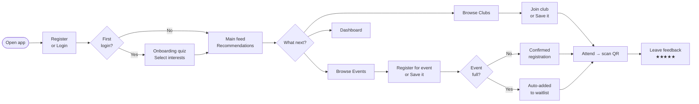

# 📱 User Guide

## User journey overview

---

## Pages

### Register & Login

- Go to `/register` to create an account.
- You need: **email**, **password** (min 8 chars, must include upper + lower case, digit, and special character).
- Optionally fill in your name, faculty, programme, and city — these improve recommendations and similar-student matching.

---

### Onboarding quiz `/onboarding`

Shown automatically on first login.

1. Browse **interest categories** (STEM, Arts, Sports, Social, …).
2. Select interests and mark each as **Low / Medium / High**.
3. Choose your **participation preference**: Clubs, Events, or Both.
4. Submit — your recommendations are ready immediately.

> You can update your interests at any time from the Dashboard.

---

### Main feed `/main`

Your personalised home screen. Shows:

- **Recommended clubs** — ranked by how closely they match your interests, boosted if you prefer clubs.
- **Recommended events** — ranked similarly, only showing future events.
- Each card shows a **recommendation explanation** (e.g. *"Recommended because it matches your Programming and Electronics interests"*).

---

### Clubs `/clubs`

A TikTok-style vertical scroll-snap feed of all active clubs.

| Action | How |
|--------|-----|
| Join a club | Click **Join** on the club card or detail page |
| Leave a club | Click **Leave** |
| Save for later | Click the bookmark icon |
| View detail | Click the club name / card |

**Club detail** page shows: description, meeting schedule (weekday + time), member count, linked events, and QR check-in button (if you are a member).

---

### Events `/events`

Browse all upcoming events. Filter by:
- **Category** (STEM, Arts, Sports, …)
- **City**
- **Online / in-person**

| Action | How |
|--------|-----|
| Register | Click **Register** on the event card |
| Join waitlist | Shown automatically when the event is full |
| Save for later | Click the bookmark icon |
| Cancel registration | From Dashboard → Registered events |

**Event detail** shows: description, date/time, location, capacity bar, attendee count, waitlist count, and a list of **similar attendees** (privacy-safe — only name, programme, and shared interests).

---

### Dashboard `/dashboard`

Your personal hub. Tabs:

| Tab | Contents |
|-----|---------|
| **Registered events** | Events you signed up for, with date and status |
| **Waitlisted events** | Your position in each waitlist |
| **Joined clubs** | Clubs you are a member of |
| **Saved clubs** | Clubs you bookmarked |
| **Saved events** | Events you bookmarked |
| **Feedback** | Ratings you have submitted |

---

### QR Check-in `/checkin`

Used to record physical attendance at events and club meetings.

**For attendees:**
1. Open `/checkin` on your phone.
2. Scan the QR code displayed by the organiser.
3. A confirmation screen confirms check-in (or tells you if you already checked in).

**For organisers / admins:**
1. Go to the event or club detail page in the admin panel.
2. Click **Generate QR** — a signed QR code appears.
3. Display it on screen or print it.

---

### Admin panel `/admin`

Only accessible with an admin account.

| Section | What you can do |
|---------|----------------|
| **Clubs** | Create, edit, deactivate clubs; set meeting schedule; generate QR tokens |
| **Events** | Create, edit, deactivate events; set capacity; generate QR tokens |
| **Feedback** | View all event and club activity ratings and comments |
| **Attendance** | Daily check-in chart; per-event and per-club attendee lists |

---

## Password requirements

| Rule | Requirement |
|------|------------|
| Length | At least 8 characters |
| Case | At least one uppercase and one lowercase letter |
| Digit | At least one number |
| Special | At least one special character (e.g. `!`, `@`, `#`) |

---

## Privacy

- The **similar students** feature only shows: display name, programme, faculty, and shared interest names.
- No email address or user ID is ever exposed to other users.
- You can opt out of appearing in attendee suggestions from the Dashboard → Settings toggle.
